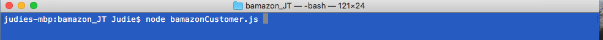
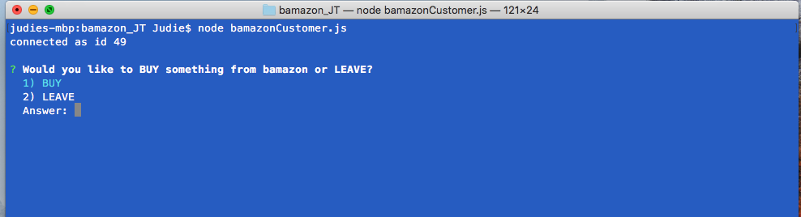
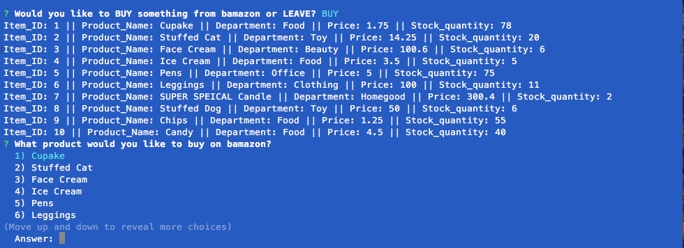
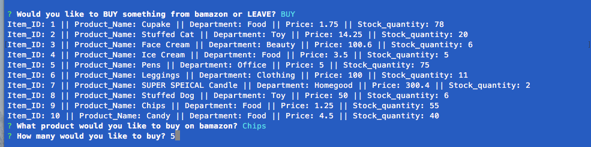
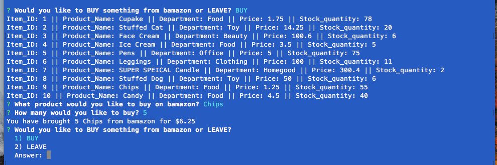
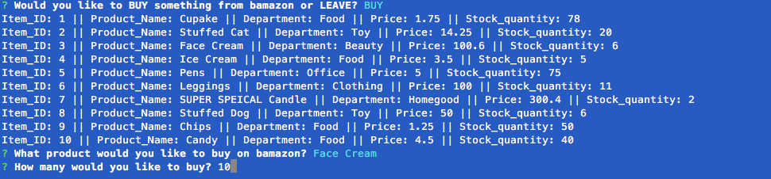
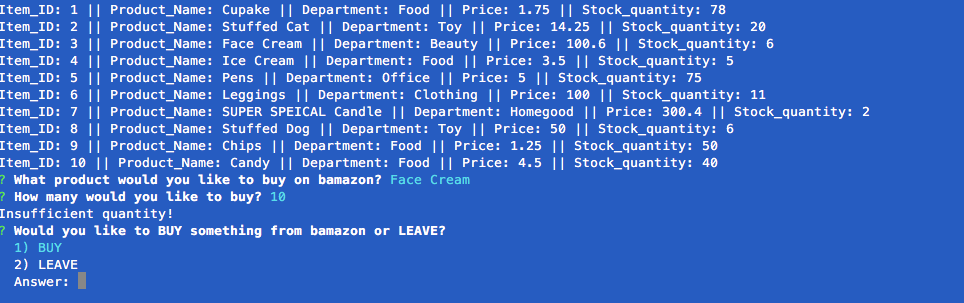

# Shopping on BamazonJT

This project was created to use node program to purchase and update inventory from a SQL database. 

## Getting Started
Please use the NPM packages “mysql” and “inquirer”

## Follow the prompts to purchase the product. Here are some screenshots below…

